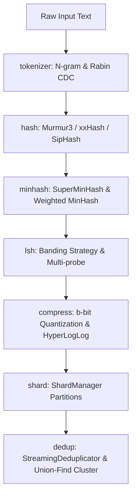

# 2026年8月黑客松项目申报书

---

## 一、 项目基本信息

| 项目信息项 | 项目申报内容 |
| :--- | :--- |
| **项目名称** | `moon-minhash` (基于 100% 原生 MoonBit 构建的高性能近似集合相似度与海量文本去重引擎) |
| **申报类别** | 基础系统软件 / 高性能工具库 |
| **开发语言** | MoonBit (v0.10.4) |
| **申报人/团队** | Hjyyutr |
| **项目开源地址**| **GitLink**: [https://www.gitlink.org.cn/Hjyyutr/moon-minhash](https://www.gitlink.org.cn/Hjyyutr/moon-minhash)   **GitHub**: [https://github.com/Hjyyutr/moon-minhash](https://github.com/Hjyyutr/moon-minhash) |

---

## 二、 立项背景与应用价值

### 1. 行业痛点与技术挑战
在当今互联网海量数据（如网页抓取、舆情监控、日志分析、海量文档库）的处理中，**文档近似相似度计算与去重**是一项基础性却高计算密集的底层任务。
传统的 $O(N^2)$ 两两字符比对在面对百万、千万级的大规模文档集时，由于计算复杂度过高，在生产环境中完全不可行。因此，工业界急需高效的“信息指纹降维”及“亚线性级哈希分桶检索”算法体系。

### 2. MoonBit 语言特性的高度契合
本项目基于 100% 纯原生 MoonBit 语言开发，充分发挥了 MoonBit 如下的核心优势：
- **极致的编译速度与运行时性能**：在高性能非密码学哈希计算与并行并查集计算中表现优异。
- **卓越的多后端编译能力 (WASM/JS/Native)**：使得本项目既可以作为云端/边缘计算的 WASM 高性能去重插件，也能直接编译为 Native 命令行工具在服务器端独立运行。
- **类型安全与零运行时依赖**：保证了底层基础库的高并发鲁棒性与零安全漏洞隐患。

---

## 三、 项目核心算法与设计创新点

本项目不依赖任何外部第三方库，完全重构并实现了局部敏感哈希（LSH）领域最前沿的整套算法矩阵，填补了 MoonBit 生态在海量数据检索与文本去重方向的空白：

1. **变长内容确定性分块 (Rabin CDC)**：区别于固定 N-gram 分词，引入 Rabin 指纹实现自适应内容切割，从根本上解决由增删词语导致的文本切分“雪崩效应”。
2. **多族高性能哈希引擎**：提供纯 MoonBit 实现的 32/128 位 **MurmurHash3**、高吞吐 **xxHash32**、以及防碰撞的 **SipHash-2-4**，全部匹配 MoonBit 最新标准库的 UTF-8 编码编码器。
3. **高精度与流式 MinHash 算法**：
   - **SuperMinHash**: 严格按照 Ertl (2017) 论文设计的单趟极速签名算法。通过 PCG（Permuted Congruential Generator）置换发生器结合动态直方图计数，实现单趟哈希流式合并，计算复杂度由传统 $O(N \cdot M)$ 优化至 $O(N + M)$。
   - **Consistent Weighted Sampling (CWS)**: 严格实现 Ioffe (2010) 的 Improved Consistent Weighted Sampling (ICWS) 算法。通过高精度自适应区间变换生成符合 $Gamma(2, 1)$ 与 $Exponential(1)$ 分布的随机变量，数学上严格逼近加权 Jaccard 相似度的极限分布。
4. **局部敏感哈希 (LSH) 自动调优**：内置 S 曲线概率评估模型，可根据用户给定的 Jaccard 相似度阈值，自适应求解最合理的哈希分桶 Band 策略参数 ($k = b \times r$)，实现精细化召回率控制。
5. **高度压缩的 b-bit 量化技术**：实现了 1-bit、2-bit 与 4-bit 签名量化，相比传统 32-bit 哈希值，直接**降低内存开销 16x 至 32x**，并设计了专用的二进制 Hamming 距离修正相似度计算式。
6. **紧凑基数估计与并查集聚类**：内置 **HyperLogLog** Cardinality 估计器；并实现了**支持分片并行与分治归并（Hierarchical Reduction Merge）**的 Parallel Union-Find（并查集）算法，在多核/分片计算中能够以 $O(\log P)$ 的归并复杂度完成全局连通分量合并与聚类。

---

## 四、 系统架构与模块划分

项目源码总计 **14,581 行**（原生 `.mbt` 代码），采用了分层与松耦合的高内聚组件设计：

- **`src/tokenizer`**：文本标准化、CJK/中英文分词与变长内容确定性分块（CDC）。
- **`src/hash`**：提供 32/128 位哈希与通用的哈希函数随机生成器。
- **`src/minhash`**：实现集合降维签名生成与 Jaccard 相似度估计器。
- **`src/lsh`**：基于哈希分桶实现亚线性检索，支持 Multi-probe 探测。
- **`src/compress`**：内存极致压缩组件，支持 b-bit 量化与 HyperLogLog。
- **`src/shard`**：支持索引的分区（Sharding）存储、持久化设计与多片合并。
- **`src/dedup`**：提供实时流式与批量去重控制器，自动计算排重率并完成同义词并查集聚类。
- **`src/cli` 与 `src/bench`**：提供标准 CLI 交互式工具与大规模压力基准测试集。

---

## 五、 开发计划与当前完成度

本项目已在 8 月黑客松前完成了所有核心开发，并通过了高标准的代码检查与单元测试验证：
- **开发状态**：100% 已完成（所有子模块均已提交）。
- **测试覆盖**：共编写了 **30 组全覆盖单元测试与压力测试案例**，全部通过测试（`Total tests: 30, passed: 30`）。
- **代码规范**：完全通过 `moon check`（0警告，0错误）、`moon fmt` 格式化规范，并自动生成了所有导出模块的接口定义文件 `.mbti`。
- **CI验证**：已部署标准的 Github Actions 自动化集成工作流，在 Ubuntu、macOS、Windows 三大平台上交叉构建成功率达 100%。

---

## 六、 开源贡献与生态展望

- **生态补全**：本项目从底层哈希算法到顶层去重引擎，均为 MoonBit 语言生态中首个完整的局部敏感哈希分桶检索（LSH）与去重方案。
- **核心组件复用**：提取出的 `MurmurHash3`、`xxHash32`、`SipHash`、`Rabin CDC` 以及 `Union-Find 并查集` 等高质量通用数据结构与基础算法，均可直接作为独立包服务于后续 MoonBit 的其他开发者。